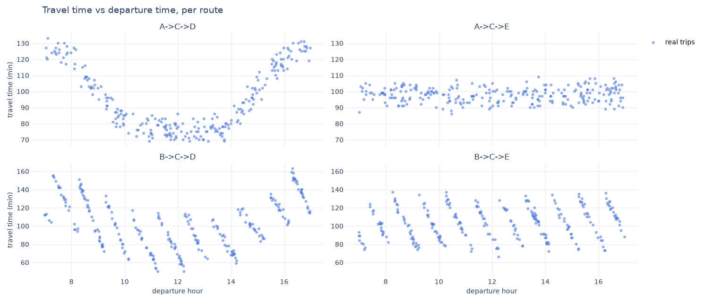

## AI-Architecture - Handin1 - Knutknut

During this Handin, we worked with representing data through plotting and then getting our model to be as close as possible to the data.

- We found that by plotting all of the data from traffic.jsonl, we have four graphs with different behaviors

- A->C->D: Looks like an inverse bell curve or U- Shape, meaning that early in the morning and in the evening, during peak traffic hours, travel times increase significantly due to traffic.

- A->C->E: Looks like a constant, meaning that whatever the start time is during the day, travel time stays about the same.

- B->C->E: This is a sawtooth function, meaning that travel times can experience recurring spikes of traffic followed by sudden drops, likely because of hourly scheduling or something like a “ferry” that passes by every hour.

- B->C->D: Looks like an inverse bell curve mixed with sawtooth wave function, meaning it combines the rush hour congestion in the morning and evening with the spikes of the passing ferry every hour.

We then had to represent them mathematically. In Task 4, we had a mathematical function to use, we are now trying to do the same by finding 4 different mathematical equations to represent each function.

---
1. Route A > C > D: Quadratic Function centered on 11:30
Equation: $f(t) = a (t - 11.5)^2 + c$
Parameters: 2 parameters ($a, c$). The travel time is the shortest around 11:30, so we fixed the center of the parabola there and only kept how steep it is ($a$) and its lowest value ($c$).
---
2. Route A > C > E: Constant Line
Equation:$f(t) = c$
Parameters: 1 parameter ($c$)
---
3. Route B > C > E: Sawtooth Wave
Equation: $f(t) = b + A \cdot \left(1.0 - ((t - s) \bmod 1.0)\right)$
Parameters: 3 parameters ($b, A, s$)
---
4. Route B > C > D: Sawtooth + Quadratic Equation
Equation: $f(t) = b + A \cdot \left(1.0 - ((t - s) \bmod 1.0)\right) + a (t - 11.5)^2$
Parameters: 4 parameters ($b, A, s$ for the sawtooth portion, plus $a$ for the parabola centered on 11:30). The two parts share the same base $b$, so no extra constant is needed for the parabola.

In total, the model has 2 + 1 + 3 + 4 = 10 parameters.
---
Training the model

To train the model we used train.py. For each trip in traffic.jsonl we computed the real duration in minutes (arrival - departure) and converted the departure time into decimal hours, so 13:17 becomes 13.28. Then we split the trips by route, so each formula is only trained on the trips of its own route.

To know how far a formula is from the data, we used the mean squared error between the predicted durations and the real ones. We started from parameters we could read on the plots, for example the ferry passing around quarter past each hour. Then we used Fortuna: 50,000 times, we added a small random change to the parameters and kept the new ones only if the error went down.

The best parameters of the four routes (10 in total) are saved in traffic_models.pkl. The Flask app loads them, computes the predicted duration of the four routes for a given departure time and recommends the shortest one.

The error we got for each route (RMSE, in minutes):

- A->C->D: 8.52
- A->C->E: 4.57
- B->C->D: 8.42
- B->C->E: 2.98

Evaluating the time saved

To know how much time the model saves for Knut Knut, we wrote evaluate.py. Without the model, we take the real durations of the trips in traffic.jsonl. The drivers used the four routes about the same number of times, whatever the time of day, and a trip took 99.6 minutes on average.

With the model, we take the same trips at the same departure times, and for each one we use the predicted duration of the route the app would recommend. The average goes down to 84.8 minutes.

So the model saves about 14.8 minutes per trip, which is 15%. Over the 1031 trips of the dataset, that is around 254 hours saved. With an hourly rate of 250 kr, this is around 63,400 kr saved. Even if the drivers always took the best single route (A->C->D, 95.7 minutes on average), the model would still save about 11 minutes per trip, because no route is the fastest all day long.

This is an estimate: we don't know how long the route the driver did not take would really have lasted, so we use the prediction of the model for it. The model is also evaluated on the same trips it was trained on.
